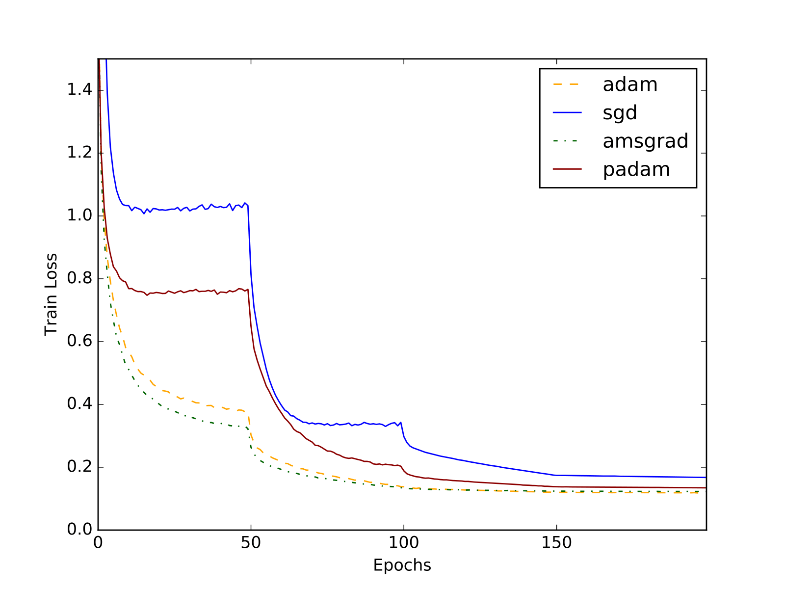
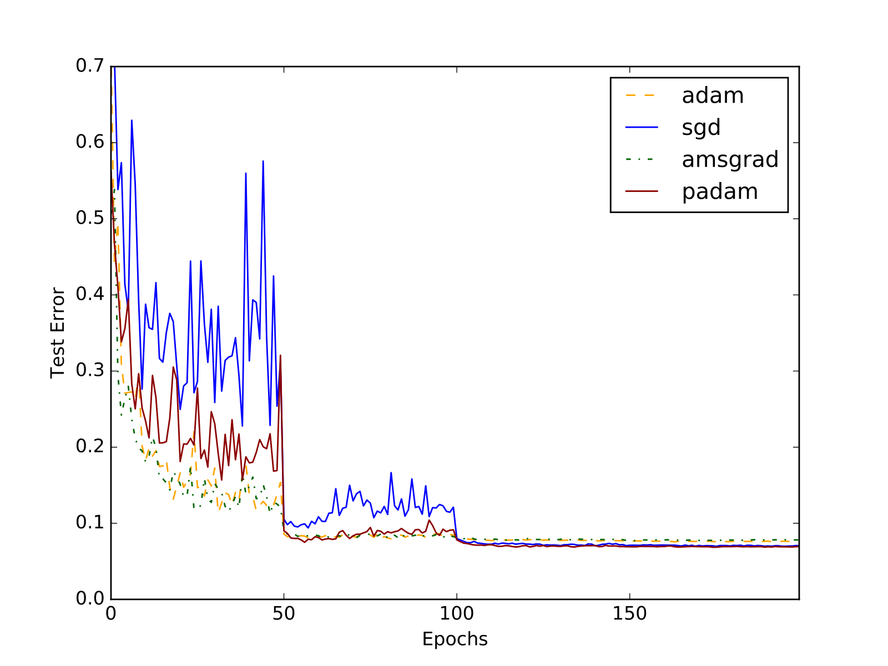

# Padam: Closing the Generalization gap of adaptive gradient methods in training deep neural networks

Introduction
---
Adaptive gradient methods such as Adam, Adagrad, Adadelta, RMSProp, Nadam, Adamw, were proposed over SGD with momentum for solving optimization of stochastic objectives in high-dimensions. Amsgrad was recently proposed as an improvement to Adam to fix convergence issues in the latter. These methods provide benefits such as faster convergence and insensitivity towards hyperparameter selection i.e. they are demonstrated to work with little tuning. On the downside, these adaptive methods have shown poor empirical performance and lesser generalization as compared to SGD. The authors try to address this problem by designing a new optimization algorithm that bridges the gap between the space of Adaptive Gradient algorithms and SGD with momentum. With this method a new tunable hyperparameter called partially adaptive parameter \textit{p} is introduced that varies between [0, 0.5].


Setup Dependencies
---
The recommended version for running the experiments is Python3.

These experiments have been written in `tensorflow's eager mode` so installing the dependencies is a must to run the code:
1. Follow the installation guide on [Tensorflow Homepage][1] for installing Tensorflow-GPU or Tensorflow-CPU. 
2. Follow instructions outlined on [Keras Homepage][2] for installing Keras.

Run a vanilla experiment using the following command at the directory root folder. 
```bash 
python vgg16-net/run.py
```

Project Structure
---
The skeletal overview of the project is as follows: 

```bash
.
├── vgg16-net/
│   ├── run.py  # A script to run the experiments over VGG Net architechture 
│   └── model.py     # VGGNet model
├── resnet18/
│   ├── run.py # A script to run the experiments over ResNet architechture
│   └── model.py     # Resnet 18 model
├── wide-resnet/
│   ├── run.py        #A script to run the experiments over ResNet architechture
│   ├── model.py    # Wide Resnet 18 model
.
folders and files below will be generated after you run the experiment in each model directory
.
├── model_{optimizer}_{dataset}.csv                 # Stores logs for the experiment 
└── model_{optimizer}_{dataset}.h5              # Stores the weights of the final model trained 
```

Defining Experiment Configuration 
---
You can set the experiment configuration by changing the dictionary in the `run.py` files. 
These dictionary contains all the hyperparameter for the each optimizers ie. Adam, Amsgrad, SGD Momentum and Padam.

Results
---
We were sucessful in reproducing the results as predicted in the paper for Cifar-10 and Cifar-100.

  
<p align=center>Results on the CIFAR-10 dataset for VGGNet.</p>

Contributors
---
- [@pandeykartikey](https://github.com/pandeykartikey)
- [@harshalmittal4](https://github.com/harshalmittal4)
- [@yashkant](http://github.com/yashkant)

[1]: https://www.tensorflow.org/install/
[2]:https://keras.io/#installation

